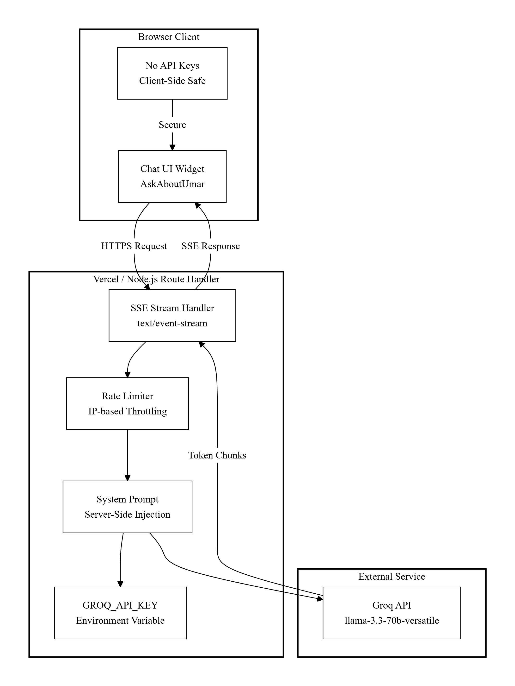

# Umar Ahmad — Portfolio Platform

A production-oriented personal portfolio built as a **content-driven Next.js application** with a grounded recruiter-facing AI assistant. The goal is not a demo site — it is a maintainable product surface: clear information architecture, secure server boundaries, and a stack section / case-study model that scales by editing data, not rewriting UI.

---

## Product intent

| Audience | Job to be done |
|----------|----------------|
| Recruiters / hiring managers | Scan role, proof of work, stack, and availability in under a minute |
| Technical interviewers | Drill into projects, tech → project mapping, architecture taste |
| Umar (owner) | Update facts, projects, and stack without touching presentation code |

The floating **Ask about Umar** chat is a controlled Q&A layer over a curated knowledge base — not an open-ended agent with tool access to the internet.

---

## Architecture at a glance


**Layering principle:** UI never owns canonical facts. Facts live in `src/content/*` (site) and `src/lib/umar-knowledge.ts` (chat grounding). Presentation components consume those modules. Chat knowledge is the stricter source of truth for the assistant.

---

## Tech stack (runtime)

| Layer | Choice | Why |
|-------|--------|-----|
| Framework | Next.js 14 (App Router) | File-based routes, RSC-friendly layout, first-class Vercel deploy |
| UI | React 18 + Tailwind | Fast composition, design tokens in `tailwind.config.ts` |
| Motion | Framer Motion + Lenis | Entrance choreography + buttery scroll without fighting layout |
| 3D | React Three Fiber + Drei + Three.js | Isolated WebGL scenes; loaded with `dynamic(..., { ssr: false })` |
| Chat LLM | Groq (`groq-sdk`) | Low-latency inference; key stays server-side only |
| Deploy target | Vercel | Native Next.js, env injection, edge-friendly Node route handlers |

---

## Repository map

```text
src/
├── app/                      # Next.js App Router shell
│   ├── layout.tsx            # Fonts, metadata, global chrome
│   ├── page.tsx              # Page composition (sections + chat)
│   ├── globals.css           # Design tokens, scroll-margin, utilities
│   └── api/chat/route.ts     # Grounded chat API (SSE)
├── components/
│   ├── *.tsx                 # Page sections (Hero, Work, …)
│   ├── chat/AskAboutUmar.tsx # Recruiter chat widget (streaming client)
│   ├── three/                # WebGL scenes (Hero, expertise, projects)
│   ├── layout/SmoothScroll.tsx
│   └── ui/                   # Reveal, Container, SectionHeader, ButtonLink
├── content/                  # Canonical site content (scale here)
│   ├── site.ts               # Identity, nav, social, tokens
│   ├── projects.ts           # Case studies → Work section
│   └── expertise.ts          # Expertise rows + stack groups
├── data/                     # Legacy / shared data mirrors (skills, etc.)
└── lib/
    ├── umar-knowledge.ts     # Chat system prompt + facts + starters
    └── rate-limit.ts         # In-memory IP rate limiter
public/                       # Static assets (portrait, architecture diagrams, etc.)
```

### Content-driven UI (how the site “scales”)

1. Edit `src/content/projects.ts` → Work section grows/shrinks automatically.
2. Edit `src/content/expertise.ts` → Expertise + Stack grids update.
3. Edit `src/content/site.ts` → Nav, CTAs, email, social, portrait path.
4. Edit `src/lib/umar-knowledge.ts` → Chat answers stay grounded (this is what recruiters hear from the bot).

`page.tsx` is deliberately thin: it wires sections; it does not hardcode portfolio facts.

---

## Page composition

Order on the homepage:

1. **Navbar** — sticky, minimal; availability CTA via mailto  
2. **Hero** — brand-first name, tagline, portrait + Hero 3D scene  
3. **Work** (`#work`) — featured case studies + secondary list  
4. **Expertise** (`#expertise`) — capability rows + small R3F previews  
5. **About** (`#about`) — narrative + principles  
6. **Stack** (`#stack`) — marquee + categorized toolkit  
7. **Contact** (`#contact`) — channels  
8. **Ask about Umar** — fixed floating widget (orthogonal to scroll)

Scroll offset for hash links is handled via `scroll-margin-top` / `scroll-padding-top` so the fixed header never clips section titles.

---

## Chatbot architecture (Ask about Umar)



### Design goals

- **Grounded:** answers only from an explicit facts block (no web search, no tool calling).
- **Safe:** `GROQ_API_KEY` never reaches the browser (`NEXT_PUBLIC_*` forbidden).
- **Usable:** SSE streaming so responses type out like ChatGPT/Claude.
- **Bounded cost:** rate limit + message length + history window.
- **Honest:** unknown facts → decline + point to email / contact form; **never** invent companies/metrics; **never** share a phone number.

### SSE contract

| Event payload | Meaning |
|---------------|---------|
| `{ "content": "…" }` | Token/delta to append |
| `{ "done": true }` | Stream finished cleanly |
| `{ "error": "…" }` | Mid-stream failure message |

Non-stream JSON errors (400 / 429 / 503 / 502) are returned when the request fails before streaming starts (bad input, rate limit, missing key, upstream init failure).

### Grounding model

`SYSTEM_PROMPT` in `src/lib/umar-knowledge.ts` includes:

- Role, education, **structured core stack**
- **Per-project tech lists** (so “which project uses FastAPI?” can be answered by cross-reference)
- Contact links (GitHub, LinkedIn, email) — share when asked
- Phone policy — refuse; route to email/contact form
- Greeting policy — short small-talk; no résumé dump on “hi”
- Tone — third person (“Umar has…”) for substantive answers

**Model choice:** `llama-3.3-70b-versatile` for better instruction following / grounding. Swap to `llama-3.1-8b-instant` in `route.ts` if you prioritize latency/cost over answer quality.

### Rate limiting (honest tradeoff)

`lib/rate-limit.ts` is an **in-memory** sliding window per IP. Fine for a personal portfolio and single-instance Node. On multi-instance serverless, limits are **best-effort per isolate** — not a global distributed quota. If abuse becomes real, move the counter to Redis / Upstash / Vercel KV without changing the chat UI.

---

## 3D & performance notes

- Canvases are **client-only** (`dynamic` + `ssr: false`) so SSR never tries to run WebGL.
- DPR capped (`dpr={[1, 1.5]}`) and `powerPreference: "high-performance"` to keep laptop GPUs sane.
- Scenes are decorative proof-of-craft, not the information channel — content remains readable if WebGL fails.

---

## Local development

```bash
npm install
cp .env.example .env.local
# Set GROQ_API_KEY in .env.local only — never commit real keys
npm run dev
```

```env
GROQ_API_KEY=your_groq_api_key_here
```

| Script | Purpose |
|--------|---------|
| `npm run dev` | Local development |
| `npm run build` | Production build + typecheck |
| `npm run start` | Serve production build |
| `npm run lint` | ESLint |

Without `GROQ_API_KEY`, the rest of the site still ships; chat returns **503** with a friendly fallback.

---

## Deploy on Vercel

1. Create a GitHub repo and push (ensure `.env.local` is gitignored — it is).
2. Import the repo in [Vercel](https://vercel.com/new) — framework: **Next.js**.
3. Project → Settings → Environment Variables:
   - `GROQ_API_KEY` → Production **and** Preview
4. Deploy. Verify:
   - Homepage loads
   - `/api/chat` streams (Ask about Umar → sample chip)
   - Contact mailto / social links work

**Do not** put the Groq key in `.env.example` or client bundles. If a key was ever committed, rotate it in the Groq console immediately.

---

## Extending the system (playbooks)

| Change | Where |
|--------|--------|
| Add a case study | `src/content/projects.ts` |
| Change stack categories | `src/content/expertise.ts` (+ mirror in `umar-knowledge.ts` for the bot) |
| Update bio / social / portrait | `src/content/site.ts` |
| Change what the bot is allowed to say | `src/lib/umar-knowledge.ts` |
| Tighten abuse controls | `src/lib/rate-limit.ts` + optionally Redis |
| Cheaper/faster model | `MODEL` in `src/app/api/chat/route.ts` |

**Invariant:** if recruiters can learn a fact from the chat, that fact must exist in `umar-knowledge.ts`. Site content and chat knowledge should be updated together for anything public-facing.

---

## Known limitations (call them out like adults)

- Chat rate limits are not globally consistent across all serverless instances.
- Grounding depends on prompt quality + model adherence; it is not a formal RAG index over PDFs.
- In-memory rate limiter resets on cold start.
- Portrait path contains an apostrophe (`umar's-pic.jpeg`); keep encoding/path usage consistent on case-sensitive hosts.

---

## License / ownership

Private portfolio of **Umar Ahmad**. All rights reserved unless otherwise stated.
